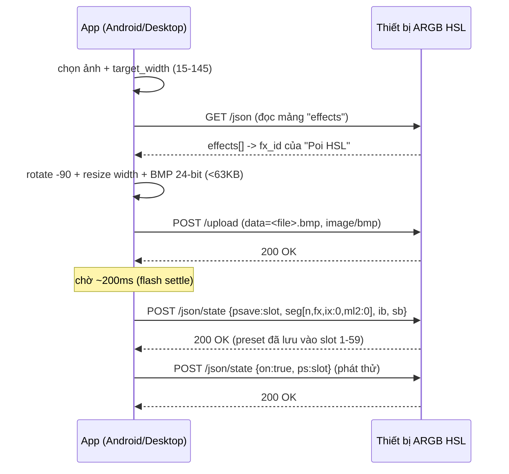
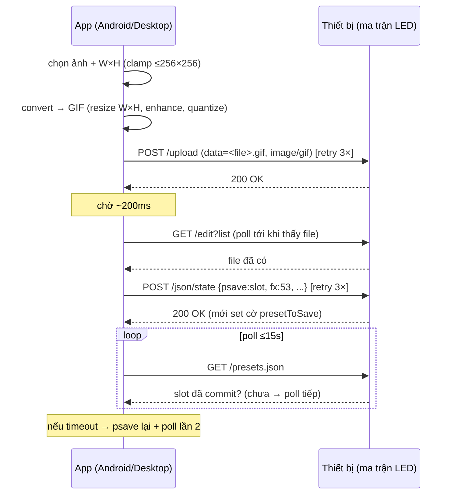

# Cơ chế tạo Preset hình ảnh — Tab "Công cụ POI" & Tab "Matrix LED"

> Tài liệu này mô tả **đầy đủ workflow** mà desktop tool đang dùng để biến một ảnh/GIF
> bất kỳ thành **preset hình ảnh** chạy trên thiết bị ARGB HSL Controller (firmware fork
> của WLED). Có **2 luồng**:
>
> - **§1–§10 — Tab Công cụ POI**: ảnh tĩnh → **BMP** → hiệu ứng `Poi HSL` (POV trên thanh quay).
> - **§11 — Tab Matrix LED**: ảnh tĩnh/động → **GIF** → hiệu ứng GIF (`fx=53`) trên ma trận LED.
>
> Hai luồng **chung phần lớn cơ chế** (slot 1–59, `POST /upload` + `psave`, payload preset,
> PIN 401) nhưng **khác** ở: định dạng file, pipeline xử lý ảnh, hiệu ứng, giới hạn kích
> thước, và độ phức tạp đồng bộ. Mục tiêu: để AI / developer **port cả hai sang app
> Android ARGB HSL**.
>
> Nguồn sự thật trong code desktop:
> - `services/image_processor.py` — `ImageProcessor.rotate_resize_width()` (xử lý ảnh POI)
> - `clients/wled_client.py` — `WledClient` / `ArgbClient` (toàn bộ HTTP với thiết bị)
> - `main.py` — POI: `upload_images_to_board()`, `upload_images_to_all_boards()`;
>   Matrix: `_t4_pick_and_upload()`, `_t4_convert_to_gif()`, `_t4_upload_pipeline()`
> - `services/preset_groups.py` — sơ đồ slot preset (`upload_slots`, `group_capacity`)
> - `config.py` — `T4_MAX_PIXELS`, `T4_MAX_DIM` (giới hạn ma trận)
>
> Mọi giá trị decisecond / range slot / endpoint dưới đây được trích trực tiếp từ code.

> **So sánh nhanh POI vs Matrix**
>
> | Tiêu chí | Tab POI (§1–10) | Tab Matrix LED (§11) |
> |---|---|---|
> | Định dạng file | **BMP 24-bit** | **GIF** (tĩnh & động) |
> | Đầu vào | PNG/JPG/BMP (ảnh tĩnh) | PNG/JPG/BMP/WEBP/GIF + (MP4→GIF) |
> | Hiệu ứng (`fx`) | `Poi HSL` (tra động qua `/json`) | **`53`** (GIF — hardcode) |
> | Kích thước | resize **width = 15–145** pixel | **W×H**, ≤ 256×256, ≤ 65536 px |
> | Giới hạn dung lượng | **< 63 KB** | **không giới hạn** |
> | Pipeline ảnh | xoay 90° + resize width + giữ tỉ lệ | resize W×H + enhance LED + quantize |
> | Slot preset | 1–59 (logo group) | 1–59 (cùng group, dùng chung) |
> | Đồng bộ nhiều mạch | tuần tự | **song song ≤ 4 mạch** |
> | Chống mất preset | retry 3× | **retry + WAIT-PERSIST poll `/presets.json`** |

---

## 0. TL;DR cho người vội

Tạo 1 preset POI = **2 lệnh HTTP** tới thiết bị:

1. **Upload file ảnh** đã xử lý (`POST /upload`) — BMP 24-bit, tên `<ten>.bmp`.
2. **Lưu preset** trỏ tới file đó (`POST /json/state` với khối `psave`) — gắn hiệu ứng
   `Poi HSL`.

Điều kiện ảnh: **xoay phải 90°**, **resize chiều rộng = số LED pixel (15–145)**, giữ tỉ
lệ, lưu BMP 24-bit, **dung lượng < 63 KB**.

Slot preset POI: **1–59** (group "logo/ảnh").

---

## 1. POI là gì & nguyên lý hiển thị

POI là cây/que LED quay tròn. Khi quay đủ nhanh, mắt người gộp các khung sáng thành
một **ảnh tròn (POV — persistence of vision)**.

- **Một cột pixel dọc theo thanh LED** = một "lát cắt bán kính" của ảnh tròn.
- Khi thanh quay, firmware lần lượt đẩy từng **hàng** của ảnh ra thanh LED theo thời gian
  → quét hết 1 vòng thì hiện trọn ảnh.

Vì vậy ảnh nguồn phải được "trải phẳng" thành một bitmap mà:

| Chiều của BMP | Ý nghĩa vật lý |
|---|---|
| **Chiều rộng (width)** | **Số LED pixel** trên thanh (mỗi cột = 1 LED). |
| **Chiều cao (height)** | **Số khung góc/thời gian** firmware quét khi POI quay 1 vòng. |

> Đây là lý do pipeline **resize theo chiều rộng** về đúng số pixel, và vì sao file càng
> nhiều "frame" (height lớn) thì dung lượng càng tăng — phải giữ < 63 KB.

---

## 2. Hai thành phần của một preset POI

Một preset POI hoàn chỉnh trên thiết bị gồm **2 thứ tách rời**:

### 2.1 File ảnh trên filesystem của thiết bị
- Định dạng: **BMP 24-bit (RGB)**.
- Tên file: chuẩn hóa từ tên ảnh gốc, ví dụ `LOGO_ABC.bmp` (xem §4).
- Nằm ở root filesystem của thiết bị (truy cập qua `/edit`).

### 2.2 Bản ghi preset trong `presets.json`
- Một entry có `id` (slot 1–59) trỏ tới file BMP qua trường `seg[].n = "/<tên>.bmp"`.
- Gắn hiệu ứng `Poi HSL`, độ sáng, và các cờ tắt transition.

Hai thứ này phải khớp nhau: **xóa file mà còn preset → preset hỏng**; ngược lại.

---

## 3. Pipeline xử lý ảnh (BẮT BUỘC giống nhau giữa các app)

Code: `ImageProcessor.rotate_resize_width()` trong `services/image_processor.py`.

```text
Ảnh gốc (PNG/JPG/BMP, bất kỳ kích thước)
   │
   ├─ 1. convert sang RGB (bỏ alpha/grayscale/palette)
   │
   ├─ 2. XOAY PHẢI 90°   →  img.rotate(-90, expand=True)
   │
   ├─ 3. RESIZE theo CHIỀU RỘNG về `target_width` (= số LED pixel),
   │      GIỮ ĐÚNG TỈ LỆ:  new_height = round(target_width / w * h)
   │      thuật toán nội suy: BILINEAR
   │
   └─ 4. LƯU BMP 24-bit
```

Pseudo-code chuẩn (ngôn ngữ-agnostic):

```python
def rotate_resize_width(target_width, img):
    img = img.convert("RGB")
    img = img.rotate(-90, expand=True)        # xoay phải 90°
    w, h = img.size
    new_height = int((target_width / w) * h)  # giữ tỉ lệ
    return img.resize((target_width, new_height), BILINEAR)
```

### 3.1 `target_width` — số LED pixel
- Người dùng nhập ở ô **"Pixel LEDs POI (15-145)"**.
- **Hợp lệ: 15 ≤ width ≤ 145** (xem `_parse_pixel_width_text` trong `main.py`).
- Khuyến nghị thực tế: **15 → 72 pixel** (cảnh báo gợi ý trong UI).
- Phải = đúng số LED vật lý trên thanh POI của thiết bị.

### 3.2 Giới hạn dung lượng — 63 KB
- Hằng số: `POI_MAX_SIZE = 63 * 1024` byte (`image_exporter.py`, `main.py`).
- BMP 24-bit ≈ `width * height * 3 + header(~54B)` (mỗi hàng pad cho chia hết 4 byte).
- Nếu **≥ 63 KB → từ chối / cảnh báo** "giảm số LED pixel" (ảnh quá cao so với số pixel).
- Trong app Android: tính kích thước trước khi upload, chặn nếu vượt.

### 3.3 Lưu ý quan trọng về orientation
- File **upload lên thiết bị** = kết quả trực tiếp của `rotate_resize_width()`.
- Preview "vòng quay" trên desktop dùng một bản **xoay thêm 90°** + biến đổi cực
  (`polar_preview`) **chỉ để hiển thị cho người dùng** — KHÔNG phải dữ liệu gửi đi.
  Android **không cần** tái tạo preview cực; chỉ cần đúng pipeline §3.

---

## 4. Quy tắc đặt tên file & tên preset

Từ `main.py` (`upload_images_to_board`, `upload_images_to_all_boards`):

```python
base         = tên file không đuôi, vd "Logo Công Ty.png" -> "Logo Công Ty"
safe         = regex thay mọi ký tự KHÔNG thuộc [a-zA-Z0-9_-] bằng "_"
preset_name  = safe[:20]            # cắt tối đa 20 ký tự
upload_filename = preset_name + ".bmp"
```

- Ví dụ: `"Logo Công Ty.png"` → preset_name `"Logo_C_ng_Ty"` → file `"Logo_C_ng_Ty.bmp"`.
- Nếu rỗng → fallback `"Preset_<id>"`.
- **ASCII-safe** (firmware ESP filesystem không ưa Unicode / khoảng trắng).

---

## 5. Sơ đồ slot preset (BẮT BUỘC tuân thủ)

Nguồn: `services/preset_groups.py`.

| Range | Nhóm | Dùng cho |
|---|---|---|
| **1 – 59** | `LOGO_RANGE` | **Preset POI / logo / ảnh** ← POI dùng range này |
| 60 – 240 | `TIMECODE_RANGE` | Tab Timecode (KHÔNG đụng tới từ POI) |
| 100 | system | Autosave backup |
| 248, 249, 250 | system | Timeline OFF placeholder / playlist / nút vật lý |

**Quy tắc ghi preset POI → chỉ slot 1–59:**

- **Ghi đè từ ID 1** (`overwrite`): slot `[1, 2, 3, ...]`, cắt ở 59. Đè preset logo cũ
  trùng ID, KHÔNG xóa preset/file khác.
- **Ghi tiếp ID trống** (`append`): chỉ dùng các slot **trống** trong 1–59 (bỏ qua slot
  đã có preset logo). Hết slot → báo & bỏ qua.

**Quy tắc xóa (group-scoped):** Tab POI chỉ được xóa preset 1–59 và file `.bmp`. Không
được đụng timecode (60–240) hay slot hệ thống.

---

## 6. Endpoint thiết bị (HTTP API)

Base URL: `http://<device-ip>`. Tất cả là WLED-compatible.

### 6.1 Tìm ID hiệu ứng "Poi HSL"
```
GET /json    →  trong JSON có mảng "effects": ["Solid", ..., "Poi HSL", ...]
fx_id = index của "Poi HSL" trong mảng.
Không tìm thấy → fallback fx_id = 0 (Solid).
```
> `main.py.get_effect_id_by_name()` trả về `255` nếu không thấy → code coi như fallback 0.
> Android nên cache mảng effects theo thiết bị.

### 6.2 Upload file BMP
```
POST /upload
Content-Type: multipart/form-data
field name: "data"   (filename = "<preset_name>.bmp", mime = "image/bmp")
```
Sau upload nên **chờ ~200 ms** để ESP ghi xong flash trước khi lưu preset.

### 6.3 Lưu preset (psave) — payload chuẩn
Code: `WledClient.save_image_preset()`.

```
POST /json/state
Content-Type: application/json
```
```json
{
  "on": true,
  "bri": 128,
  "seg": [
    {
      "id": 0,
      "on": true,
      "bri": 255,
      "n": "/LOGO_ABC.bmp",
      "fx": 117,
      "ix": 0,
      "ml2": 0
    }
  ],
  "psave": 5,
  "n": "LOGO_ABC",
  "ib": true,
  "sb": true
}
```

Giải thích từng trường (rất quan trọng — đừng bỏ):

| Trường | Ý nghĩa |
|---|---|
| `on` (top) | Bật thiết bị (global). |
| `bri` (top) | Độ sáng global (mặc định 128, lấy từ setting `pixel_brightness`). |
| `seg[0].id` | Segment 0. |
| `seg[0].on` | Segment bật. |
| `seg[0].bri` | Độ sáng segment (255). |
| `seg[0].n` | **Đường dẫn file ảnh** — phải có dấu `/` ở đầu: `"/<file>.bmp"`. |
| `seg[0].fx` | ID hiệu ứng `Poi HSL` (xem §6.1). |
| `seg[0].ix` | **= 0**: tắt intensity để firmware lấy đúng pixel của ảnh (KHÔNG blend). |
| `seg[0].ml2` | **= 0**: tắt hiệu ứng transition khi đổi frame. |
| `psave` | **Slot preset cần lưu** (1–59). Đây là lệnh "save preset". |
| `n` (top) | Tên hiển thị của preset. |
| `ib` | include brightness — buộc firmware "nướng" `on`/`bri` global vào preset. |
| `sb` | include segment bounds — lưu start/stop/startY/stopY của segment. |

> Thiếu `ib`/`sb`: preset chỉ lưu data segment, khi load lại **không chỉnh được độ sáng
> global** → ảnh có thể không hiện đúng. Bắt buộc giữ cả hai.

### 6.4 Phát / tắt / xóa
```
Play preset :  POST /json/state   {"ps": <slot>}        (online → {"on": true, "ps": slot})
Tắt LED     :  POST /json/state   {"on": false}
Xóa preset  :  POST /json/state   {"pdel": <slot>}
Liệt kê file:  GET  /edit?list                          → [{"name","size"}, ...]
Xóa file    :  GET  /edit?func=delete&path=/<file>.bmp
```

### 6.5 PIN / 401
Một số thiết bị khóa `/edit` & ghi preset bằng **Settings PIN 4 số**. Khi gặp HTTP 401:
- Gửi PIN: `POST /settings/sec` với form `PIN=<4 số>` (so khớp 4 ký tự đầu).
- WLED trả 200 cả khi đúng/sai → kiểm tra lại bằng `GET /edit` (200 = đã mở khóa).
- Có cooldown ~5s sau khi sai. Desktop bọc mọi call trong `pin_retry` (retry đúng 1 lần
  sau khi nhập PIN). Android nên có flow tương tự (popup nhập PIN → retry).

---

## 7. Workflow đầy đủ — tạo preset POI

### 7.1 Gửi 1 thiết bị, nhiều ảnh (`upload_images_to_board`)

```text
1.  Chọn thiết bị (IP) đang online.
2.  fx_id = get_effect_id_by_name(ip, "Poi HSL")  (fallback 0 nếu 255).
3.  Người dùng chọn nhiều ảnh (PNG/JPG/BMP).
4.  target_width = ô "Pixel LEDs POI" (15–145).
5.  Với mỗi ảnh, theo thứ tự (idx = 1, 2, 3, ...):
      a. preset_name / upload_filename  (§4).
      b. bmp = rotate_resize_width(target_width, img)   (§3).
      c. lưu bmp ra file tạm.
      d. POST /upload  (BMP)            → chờ 200 ms.
      e. POST /json/state {psave...}    → retry tối đa 3 lần, delay 300 ms.
            preset_id = idx  (ghi đè từ 1).
            bri = setting "pixel_brightness" (mặc định 128).
      f. xóa file tạm.
      g. delay ~400 ms trước ảnh kế (cho ESP ổn định).
6.  Báo hoàn tất, refresh danh sách preset.
```

### 7.2 Đồng bộ nhiều thiết bị (`upload_images_to_all_boards` — "Gửi nhiều POI")

```text
1.  Lấy danh sách thiết bị từ combobox → popup chọn nhiều thiết bị.
2.  Chọn nhiều ảnh + lấy target_width (strict, bắt buộc hợp lệ).
3.  Load tất cả ảnh (PIL), cho GUI "thở" mỗi 5 ảnh.
4.  Hỏi CHẾ ĐỘ GHI:
       ♻️ Ghi đè từ ID 1   (overwrite)
       ➕ Ghi tiếp ID trống (append)
5.  Với mỗi thiết bị đã chọn:
       a. fx_id = get_effect_id_by_name(ip, "Poi HSL").
       b. đọc presets.json → tính danh sách slot (1–59) theo chế độ (§5).
          - hết slot → bỏ qua thiết bị.
          - thiếu slot → ghi phần đầu, cảnh báo.
       c. an toàn: play_preset(0) + set_off() trước khi ghi.
       d. Với mỗi (ảnh, slot):
            - convert BMP (§3).
            - POST /upload  → chờ 200 ms.
            - POST /json/state {psave...} → retry 3 lần.
            - sau khi lưu: set_off()  (tắt LED ngay để khỏi nhấp nháy).
            - xóa file tạm.
6.  Báo hoàn tất, refresh.
```

### 7.3 Sequence diagram



---

## 8. Xử lý lỗi & độ bền (nên port sang Android)

- **Retry lưu preset 3 lần**, delay 200–300 ms giữa các lần (ESP đôi khi bận ghi flash).
- **Delay flash settle ~200 ms** sau mỗi `/upload` trước khi `psave`.
- **An toàn trước khi ghi hàng loạt**: `ps:0` rồi `on:false` để LED không nhấp nháy.
- **Session/connection pool**: ESP webserver chỉ chịu ~4 socket đồng thời → tái sử dụng
  kết nối, đừng bắn song song nhiều request tới cùng 1 IP.
- **Timeout tham khảo** (giây): liveness 0.5, read 2.0, write 3.0, **upload 12.0**.
- **Kiểm tra 63 KB trước upload**, báo lỗi sớm nếu vượt.
- **PIN 401**: bắt 401 → nhập PIN → retry 1 lần.

---

## 9. Checklist port sang App Android ARGB HSL

- [ ] Ô nhập số LED pixel, validate **15–145**.
- [ ] Xử lý ảnh: RGB → **xoay phải 90°** → **resize width = pixel count** (giữ tỉ lệ,
      bilinear) → **BMP 24-bit**.
- [ ] Chặn upload nếu BMP **≥ 63 KB**.
- [ ] Chuẩn hóa tên: `[^a-zA-Z0-9_-] → "_"`, cắt 20 ký tự, đuôi `.bmp`.
- [ ] `GET /json` → tìm `fx_id` của `"Poi HSL"` (fallback 0).
- [ ] `POST /upload` multipart field `data`, mime `image/bmp`.
- [ ] Chờ ~200 ms.
- [ ] `POST /json/state` payload §6.3 (đủ `ix:0`, `ml2:0`, `ib`, `sb`, `psave`).
- [ ] Slot trong **1–59**; hỗ trợ chế độ **ghi đè từ 1** / **ghi tiếp slot trống**.
- [ ] Retry 3 lần khi lưu preset; tắt LED sau khi lưu (nếu ghi hàng loạt).
- [ ] Flow PIN 401.
- [ ] Phát thử: `POST /json/state {"on":true,"ps":slot}`.
- [ ] Tuân thủ ranh giới xóa: chỉ xóa preset 1–59 + file `.bmp`.

---

## 10. Tham chiếu nhanh các hằng số

| Hằng số | Giá trị | Nguồn |
|---|---|---|
| Pixel width hợp lệ | 15 – 145 | `main.py._parse_pixel_width_text` |
| Pixel width khuyến nghị | 15 – 72 | `main.py._warn_width` |
| Dung lượng BMP tối đa | 63 × 1024 byte | `POI_MAX_SIZE` |
| Slot POI / logo | 1 – 59 | `preset_groups.LOGO_RANGE` |
| Độ sáng global mặc định | 128 | setting `pixel_brightness` |
| Độ sáng segment | 255 | `save_image_preset` |
| `ix` (intensity) | 0 | `save_image_preset` |
| `ml2` (transition) | 0 | `save_image_preset` |
| Hiệu ứng | `"Poi HSL"` | `get_effect_id_by_name` |
| Upload timeout | 12 s | `WledClient.T_UPLOAD` |
| Flash settle delay | ~200 ms | `upload_images_to_*` |
| Retry lưu preset | 3 lần | `upload_images_to_*` |

---

## 11. PHẦN B — Tab Matrix LED: tạo preset GIF cho ma trận LED

Tab Matrix LED (trong code là tiền tố `_t4`) biến ảnh tĩnh/động thành **preset GIF** chạy
trên **ma trận LED 2 chiều (W×H)**. Cơ chế giống POI (upload file → `psave`), nhưng:

- File là **GIF** (hỗ trợ ảnh động nhiều khung), không phải BMP.
- Hiệu ứng cố định **`fx = 53`** (hiệu ứng GIF của firmware) — **không tra theo tên**.
- Có kích thước **2 chiều W×H**, không có giới hạn 63 KB.
- Đồng bộ **song song nhiều mạch** + cơ chế **WAIT-PERSIST** chống mất preset.

> Slot preset Matrix **dùng chung group logo/ảnh 1–59** với POI (xem §5). Nên một thiết bị
> chỉ có thể chứa tổng cộng ≤ 59 preset logo (POI BMP + Matrix GIF cộng lại).

### 11.1 Kích thước ma trận (W×H) & giới hạn RAM

Code: `config.py`, `main.py._t4_clamp_to_safe()`.

- Người dùng nhập **W** và **H** (mỗi ô spinbox cho 1–512 trong UI).
- Phải = đúng số cột × số hàng LED vật lý của ma trận.
- **Giới hạn an toàn cho RAM chip ARGB HSL:**
  - Tổng pixel `W * H ≤ T4_MAX_PIXELS = 256 × 256 = 65 536`.
  - Mỗi cạnh `≤ T4_MAX_DIM = 256`.
- Vượt giới hạn → **tự động co (giữ tỉ lệ)** bằng hệ số `min(√(MAX/px), MAX/maxdim)` và
  cảnh báo, KHÔNG từ chối.
- Khuyến nghị: `≤ 256×256`. Pitch LED 2 cm → ảnh được tăng tương phản tự động.

### 11.2 Pipeline xử lý ảnh → GIF

Code: `_t4_convert_to_gif()`. Có **2 nhánh** tùy ảnh tĩnh hay động:

**(a) GIF động (nhiều khung):**
```text
- Nếu đã đúng W×H và là .gif động → COPY thẳng (pass-through, không re-encode,
  vd file vừa convert MP4→GIF bằng ffmpeg).
- Ngược lại: với MỖI khung:
    seek(i) → convert RGBA → resize(W, H, LANCZOS)
    giữ nguyên duration từng khung + loop gốc, disposal = 2
  → lưu save_all (giữ trọn animation, KHÔNG drop khung).
```

**(b) Ảnh tĩnh (PNG/JPG/BMP/WEBP/GIF 1 khung):** tối ưu cho LED 2 cm pitch:
```text
1. _t4_enhance_for_led:
     Color   × 1.40   (tăng bão hòa)
     Contrast× 1.25
     Vividness slider 0..100 → gamma 1.0..0.70 (γ<1 lift midtones), áp nếu >0
2. _t4_resize_and_quantize:
     resize(W, H, BOX)              # trung bình diện tích — downscale sạch, không ringing
     kill_dim_pixels(threshold=36) # max(R,G,B) < 36 → ép đen tuyệt đối (xóa halo viền)
     quantize(colors=64, MEDIANCUT, dither=NONE)  # ít màu, không dither → nền đen sạch
3. lưu .gif (loop=0).
```

> Khác POI: Matrix **không xoay 90°**, dùng **BOX** (không BILINEAR), có bước **enhance +
> quantize** chuyên cho LED. Android nên áp tối thiểu: resize đúng W×H + (tùy chọn) tăng
> tương phản + ép pixel tối về đen để hình rõ trên ma trận.

### 11.3 Đặt tên file & preset (Matrix)
```python
stem        = tên file không đuôi
preset_name = stem[:24]  or  f"Preset_{idx}"     # cắt 24 ký tự (POI cắt 20)
upload_filename = preset_name + ".gif"
```

### 11.4 Payload lưu preset GIF

Giống §6.3 nhưng **`fx = 53`** và file `.gif`. Code: `_t4_save_preset_with_retry()` →
`save_image_preset(fx_id=53, ...)`.

```json
{
  "on": true,
  "bri": 200,
  "seg": [
    { "id": 0, "on": true, "bri": 255, "n": "/LOGO_ABC.gif", "fx": 53, "ix": 0, "ml2": 0 }
  ],
  "psave": 5,
  "n": "LOGO_ABC",
  "ib": true,
  "sb": true
}
```

- `bri` (global) = `slider_t4_bri` (phần trăm) → `bri = pct * 255 // 100`.
- `seg[0].n` = `"/<file>.gif"`.
- Các trường còn lại (`ix:0`, `ml2:0`, `ib`, `sb`) ý nghĩa như §6.3.

### 11.5 Endpoint Matrix (khác POI ở đâu)

```text
Upload GIF :  POST /upload   field "data", mime "image/gif"
              timeout co giãn theo dung lượng GIF:
              timeout = clamp( 30 + size/40000 , 30s , 300s )   # GIF có thể vài MB
Chờ file   :  GET /edit?list  → poll đến khi <file>.gif xuất hiện (≤ 5s)
Lưu preset :  POST /json/state {psave...}  (fx=53)
WAIT-PERSIST: GET /presets.json → poll đến khi slot pid xuất hiện (≤ 15s)
```

### 11.6 ⚠ WAIT-PERSIST — cơ chế CHỐNG MẤT PRESET (bắt buộc port)

Code: `_t4_wait_preset_persisted()` + `_t4_upload_pipeline()`.

> **Vấn đề firmware:** WLED chỉ có **một biến `presetToSave` duy nhất**. Lệnh `psave` qua
> HTTP chỉ **set cờ**; main loop của firmware mới commit vào flash sau đó. Nếu gửi `psave`
> kế tiếp **trước khi** main loop kịp xử lý cờ trước → cờ bị ghi đè → **preset trước MẤT
> VĨNH VIỄN**. Đây chính là lỗi "mất preset cách quãng" (every-other) khi upload nhanh.

**Giải pháp:** sau mỗi `psave`, **poll `/presets.json` cho tới khi slot đó thật sự xuất
hiện** rồi mới sang file kế. Đây là cách serialize theo đúng nhịp (cadence) thật của WLED.

Pipeline 1 file / 1 mạch (`_t4_upload_pipeline`):
```text
1. POST /upload (GIF)              — retry 3×, backoff 0.5/1.0/1.5s
2. chờ ~200 ms (flash settle)
3. GET /edit?list → wait file ready (≤ 5s)
4. POST psave (fx=53)             — retry 3×, backoff 0.3/0.6/0.9s
5. WAIT-PERSIST: poll /presets.json (≤ 15s)
      ├─ thấy pid  → DONE
      └─ timeout   → sleep 1s → psave LẠI → WAIT-PERSIST lần 2 (≤ 15s)
                       ├─ thấy  → DONE
                       └─ vẫn timeout (tổng ~30s) → raise (fail thật)
```

### 11.7 Workflow upload đầy đủ (`_t4_pick_and_upload`)

```text
1.  Chọn mạch đích: "chỉ mạch đã chọn" hoặc TẤT CẢ mạch đang online.
2.  Chọn ảnh (PNG/JPG/BMP/WEBP/GIF) — hoặc nhận sẵn list GIF (từ MP4→GIF, skip_convert).
3.  Hỏi CHẾ ĐỘ:
       🗑 Xóa hết & Upload : xóa preset logo (1-59) + GIF cũ → ghi từ ID 1
       ➕ Ghi vào ID trống : giữ preset cũ, chỉ ghi slot trống trong 1-59
4.  Lấy W×H từ spinbox → clamp về ngưỡng an toàn (§11.1).
5.  B1 — Chuẩn bị slot:
       - Xóa hết  → xóa song song (≤4 thread) preset logo + GIF trên từng mạch.
       - Ghi trống → đọc /presets.json từng mạch, tính slot trống qua upload_slots().
         (đọc presets.json lỗi → BỎ QUA mạch đó, tránh ghi đè nhầm slot)
6.  B2 — Convert tất cả ảnh sang GIF (CPU, tuần tự) → danh sách gif_jobs.
7.  B3 — Gán slot cho từng (mạch × file); hết slot 1-59 → cảnh báo, bỏ phần dư.
8.  B4 — Chạy worker SONG SONG tối đa 4 mạch; mỗi mạch xử lý file TUẦN TỰ
        qua _t4_upload_pipeline (§11.6). UI gom kết quả ok/fail/skip qua queue.
9.  Báo tổng kết ok/fail, refresh.
```

> **Đồng bộ:** Matrix gửi song song **giữa các mạch** (≤ 4) để nhanh, nhưng **trong cùng
> một mạch luôn tuần tự** (do ràng buộc `presetToSave` ở §11.6). Đừng bao giờ bắn 2 `psave`
> song song tới cùng 1 IP.

### 11.8 Sequence diagram (Matrix, 1 mạch)



### 11.9 Checklist port Matrix sang Android (bổ sung cho §9)

- [ ] Hai ô nhập **W** và **H**; clamp **W*H ≤ 65536** và **mỗi cạnh ≤ 256** (giữ tỉ lệ).
- [ ] Convert sang **GIF**:
      - ảnh động → resize từng khung (LANCZOS), giữ duration + loop, disposal=2.
      - ảnh tĩnh → enhance (Color 1.40, Contrast 1.25, vividness gamma) → resize BOX →
        kill pixel tối (<36 → đen) → quantize 64 màu, no dither.
- [ ] Tên: cắt **24 ký tự** + `.gif`.
- [ ] `POST /upload` mime `image/gif`, timeout co giãn `clamp(30+size/40000, 30, 300)`s.
- [ ] **Wait file** (`/edit?list`) trước khi psave.
- [ ] `psave` với **`fx = 53`** + đủ `ix:0, ml2:0, ib, sb`.
- [ ] **WAIT-PERSIST** (`/presets.json`) sau psave — đây là bước QUAN TRỌNG NHẤT, không
      được bỏ; tuần tự hóa psave trong cùng 1 mạch.
- [ ] Slot 1–59 (dùng chung POI); 2 chế độ Xóa-hết / Ghi-trống.
- [ ] Song song giữa các mạch ≤ 4; tuần tự trong 1 mạch.

### 11.10 Hằng số Matrix (tham chiếu nhanh)

| Hằng số | Giá trị | Nguồn |
|---|---|---|
| Tổng pixel tối đa | 256 × 256 = 65 536 | `config.T4_MAX_PIXELS` |
| Cạnh tối đa | 256 | `config.T4_MAX_DIM` |
| Hiệu ứng GIF | `fx = 53` | `_t4_save_preset_with_retry` |
| Slot Matrix | 1 – 59 (chung POI) | `preset_groups.LOGO_RANGE` |
| Tên preset cắt | 24 ký tự | `_t4_pick_and_upload` |
| Resize ảnh động | LANCZOS | `_t4_convert_to_gif` |
| Resize ảnh tĩnh | BOX | `_t4_resize_and_quantize` |
| Kill-dim threshold | max(RGB) < 36 → đen | `_t4_kill_dim_pixels` |
| Quantize | 64 màu, MEDIANCUT, no dither | `_t4_resize_and_quantize` |
| Upload timeout | clamp(30+size/40000, 30, 300) s | `_t4_upload_with_retry` |
| Wait file | ≤ 5 s poll `/edit?list` | `_t4_wait_file_ready` |
| Wait persist | ≤ 15 s poll `/presets.json` (×2) | `_t4_wait_preset_persisted` |
| Song song mạch | ≤ 4 worker | `_t4_pick_and_upload` |
| Retry upload / psave | 3 lần (có backoff) | `_t4_*_with_retry` |

---

**PHẦN C — Code tham khảo Android (Kotlin) + file mẫu**

> Phần này cung cấp **code Kotlin chạy được** cho Android dev, bám sát pipeline desktop ở
> trên. Mọi đoạn đều có thể copy thẳng vào dự án (chỉ cần thêm dependency OkHttp). Trọng
> tâm 2 phần khó nhất: **(1) tự encode BMP 24-bit** (Android KHÔNG có sẵn encoder BMP) và
> **(2) cơ chế upload + psave + WAIT-PERSIST**.

## 12. File mẫu để test

Trong thư mục [`docs/samples/`](samples/):

| File | Mô tả |
|---|---|
| `poi_logo_source.png` | Ảnh nguồn 256×256 (logo 4 múi màu) — đầu vào ví dụ. |
| `poi_logo_w72.bmp` | Kết quả pipeline POI với `target_width = 72` → **BMP 24-bit 72×72, 15.2 KB**. Đây là **đúng định dạng phải upload** lên thiết bị. |

Android dev có thể: (a) so sánh byte-by-byte output encoder của mình với `poi_logo_w72.bmp`;
(b) upload thẳng file mẫu này để kiểm thử endpoint `/upload` + `psave` trước khi làm UI.

**Đặc tả BMP mà firmware chấp nhận (PIL tạo ra — Android phải tạo y hệt):**

| Trường | Giá trị |
|---|---|
| Signature | `"BM"` (0x42 0x4D) |
| Tổng header | **54 byte** (14 file header + 40 BITMAPINFOHEADER) |
| Pixel data offset | 54 |
| DIB header size | 40 |
| Bits/pixel | **24** (RGB, không alpha) |
| Compression | **0** (BI_RGB, không nén) |
| Chiều cao | **dương** → **bottom-up** (hàng cuối ảnh nằm đầu file) |
| Thứ tự kênh | **BGR** (không phải RGB) |
| Padding hàng | mỗi hàng pad 0x00 cho **chia hết 4 byte** |

## 13. Dependency

```kotlin
// build.gradle (app)
dependencies {
    implementation("com.squareup.okhttp3:okhttp:4.12.0")
    // GIF động (Tab Matrix) — encoder GIF cho Android (chọn 1):
    // implementation("com.github.bumptech.glide:gifencoder:...")  // hoặc vendor AnimatedGifEncoder.java
}
```

## 14. Hằng số chung

```kotlin
object ArgbConst {
    const val POI_MIN_W = 15
    const val POI_MAX_W = 145
    const val POI_MAX_SIZE = 63 * 1024        // 63 KB cho BMP POI

    const val LOGO_LO = 1                      // slot group logo/ảnh
    const val LOGO_HI = 59
    val SYSTEM_SLOTS = setOf(100, 248, 249, 250)

    const val MATRIX_MAX_PIXELS = 256 * 256    // 65536
    const val MATRIX_MAX_DIM = 256
    const val FX_GIF = 53                       // hiệu ứng GIF (Matrix) — hardcode
    const val FX_POI_NAME = "Poi HSL"           // POI — tra động qua /json
}
```

## 15. POI — xử lý ảnh (xoay 90° + resize width)

```kotlin
import android.graphics.Bitmap
import android.graphics.Matrix

/** Xoay phải 90° + resize theo CHIỀU RỘNG = targetWidth, giữ tỉ lệ (bilinear).
 *  Tương đương ImageProcessor.rotate_resize_width() bên desktop. */
fun rotateResizeWidth(src: Bitmap, targetWidth: Int): Bitmap {
    // 1) xoay phải 90° (clockwise) — khớp PIL img.rotate(-90)
    val m = Matrix().apply { postRotate(90f) }
    val rotated = Bitmap.createBitmap(src, 0, 0, src.width, src.height, m, true)

    // 2) resize theo chiều rộng, giữ tỉ lệ
    val newH = Math.round(targetWidth.toFloat() / rotated.width * rotated.height)
        .coerceAtLeast(1)
    // filter=true => nội suy mượt (tương đương BILINEAR)
    return Bitmap.createScaledBitmap(rotated, targetWidth, newH, true)
}
```

## 16. POI — encoder BMP 24-bit (QUAN TRỌNG: Android không có sẵn)

```kotlin
import android.graphics.Bitmap
import java.io.ByteArrayOutputStream
import java.nio.ByteBuffer
import java.nio.ByteOrder

/** Encode Bitmap -> BMP 24-bit (bottom-up, BGR, pad 4 byte/hàng).
 *  Output BYTE-IDENTICAL với BMP do PIL.save(..,"BMP") tạo ra. */
fun encodeBmp24(bmp: Bitmap): ByteArray {
    val w = bmp.width
    val h = bmp.height
    val rowSize = (w * 3 + 3) / 4 * 4          // pad bội số 4
    val pixelArraySize = rowSize * h
    val fileSize = 54 + pixelArraySize

    val out = ByteArray(fileSize)
    val buf = ByteBuffer.wrap(out).order(ByteOrder.LITTLE_ENDIAN)

    // --- BITMAPFILEHEADER (14 byte) ---
    buf.put('B'.code.toByte()); buf.put('M'.code.toByte())
    buf.putInt(fileSize)        // file size
    buf.putInt(0)               // reserved
    buf.putInt(54)              // offset tới pixel data

    // --- BITMAPINFOHEADER (40 byte) ---
    buf.putInt(40)              // header size
    buf.putInt(w)               // width
    buf.putInt(h)               // height DƯƠNG => bottom-up
    buf.putShort(1)             // planes
    buf.putShort(24)            // bits/pixel
    buf.putInt(0)               // compression = BI_RGB
    buf.putInt(pixelArraySize)
    buf.putInt(3780)            // X ppm (96 DPI) — khớp PIL để byte-identical; firmware bỏ qua
    buf.putInt(3780)            // Y ppm
    buf.putInt(0)               // colors used
    buf.putInt(0)               // important colors

    // --- Pixel data: bottom-up, BGR ---
    val pixels = IntArray(w * h)
    bmp.getPixels(pixels, 0, w, 0, 0, w, h)    // ARGB, top-down
    var pos = 54
    for (y in h - 1 downTo 0) {                // bottom-up
        var rowPos = pos
        val base = y * w
        for (x in 0 until w) {
            val c = pixels[base + x]
            out[rowPos++] = (c and 0xFF).toByte()          // B
            out[rowPos++] = ((c shr 8) and 0xFF).toByte()  // G
            out[rowPos++] = ((c shr 16) and 0xFF).toByte() // R
        }
        pos += rowSize                          // bytes pad đã = 0 sẵn
    }
    return out
}

/** Kiểm tra giới hạn 63 KB trước khi upload. */
fun poiBmpFitsLimit(bmpBytes: ByteArray) = bmpBytes.size < ArgbConst.POI_MAX_SIZE
```

## 17. HTTP client (OkHttp) — upload, psave, play, effect, PIN

```kotlin
import okhttp3.*
import okhttp3.MediaType.Companion.toMediaType
import okhttp3.RequestBody.Companion.toRequestBody
import org.json.JSONObject
import java.util.concurrent.TimeUnit

class ArgbClient(private val ip: String) {
    private val base = "http://$ip"
    private val client = OkHttpClient.Builder()
        .connectTimeout(5, TimeUnit.SECONDS)
        .readTimeout(15, TimeUnit.SECONDS)
        .writeTimeout(300, TimeUnit.SECONDS)   // upload GIF có thể lâu
        .build()

    // ---- GET /json: tra fx_id theo tên (POI) ----
    fun getEffectId(name: String): Int {
        val req = Request.Builder().url("$base/json").build()
        client.newCall(req).execute().use { r ->
            val effects = JSONObject(r.body!!.string()).optJSONArray("effects")
                ?: return 0
            for (i in 0 until effects.length()) {
                if (effects.optString(i) == name) return i
            }
        }
        return 0   // không thấy -> fallback Solid (giống desktop coi 255 như 0)
    }

    // ---- POST /upload (multipart, field "data") ----
    fun uploadFile(bytes: ByteArray, filename: String, mime: String) {
        val body = MultipartBody.Builder().setType(MultipartBody.FORM)
            .addFormDataPart("data", filename, bytes.toRequestBody(mime.toMediaType()))
            .build()
        val req = Request.Builder().url("$base/upload").post(body).build()
        client.newCall(req).execute().use { r -> require(r.isSuccessful) }
    }

    fun uploadBmp(bytes: ByteArray, filename: String) =
        uploadFile(bytes, filename, "image/bmp")
    fun uploadGif(bytes: ByteArray, filename: String) =
        uploadFile(bytes, filename, "image/gif")

    // ---- POST /json/state ----
    private fun postState(json: JSONObject) {
        val body = json.toString().toRequestBody("application/json".toMediaType())
        val req = Request.Builder().url("$base/json/state").post(body).build()
        client.newCall(req).execute().use { r -> require(r.isSuccessful) }
    }

    /** psave: lưu preset hình ảnh (BMP/POI dùng fx tra được; GIF/Matrix dùng fx=53). */
    fun saveImagePreset(
        uploadFilename: String, presetId: Int, presetName: String,
        fxId: Int, bri: Int = 128, segBri: Int = 255, segId: Int = 0
    ) {
        val seg = JSONObject()
            .put("id", segId).put("on", true).put("bri", segBri)
            .put("n", "/$uploadFilename").put("fx", fxId)
            .put("ix", 0).put("ml2", 0)
        val payload = JSONObject()
            .put("on", true).put("bri", bri)
            .put("seg", org.json.JSONArray().put(seg))
            .put("psave", presetId).put("n", presetName)
            .put("ib", true).put("sb", true)
        postState(payload)
    }

    fun playPreset(slot: Int) = postState(JSONObject().put("on", true).put("ps", slot))
    fun setOff() = postState(JSONObject().put("on", false))
    fun deletePreset(slot: Int) = postState(JSONObject().put("pdel", slot))

    // ---- /presets.json (đọc + WAIT-PERSIST) ----
    fun getPresets(): JSONObject {
        val req = Request.Builder().url("$base/presets.json").build()
        client.newCall(req).execute().use { r -> return JSONObject(r.body!!.string()) }
    }

    /** /edit?list -> kiểm tra file đã có trên thiết bị chưa. */
    fun fileExists(filename: String): Boolean {
        val target = filename.trimStart('/').lowercase()
        val req = Request.Builder().url("$base/edit?list").build()
        client.newCall(req).execute().use { r ->
            val arr = org.json.JSONArray(r.body!!.string())
            for (i in 0 until arr.length()) {
                val n = arr.getJSONObject(i).optString("name").trimStart('/').lowercase()
                if (n == target) return true
            }
        }
        return false
    }

    /** PIN 401: POST /settings/sec form PIN=#### ; sau đó GET /edit để xác nhận. */
    fun submitPin(pin: String): Boolean {
        val body = FormBody.Builder().add("PIN", pin.take(4)).build()
        client.newCall(Request.Builder().url("$base/settings/sec").post(body).build())
            .execute().use { }
        val edit = Request.Builder().url("$base/edit").build()
        return runCatching {
            client.newCall(edit).execute().use { it.isSuccessful }
        }.getOrDefault(false)
    }
}
```

## 18. POI — orchestration tạo 1 preset (đầy đủ)

```kotlin
fun createPoiPreset(
    client: ArgbClient, sourceBitmap: Bitmap, rawName: String,
    targetWidth: Int, slot: Int, bri: Int = 128
) {
    require(targetWidth in ArgbConst.POI_MIN_W..ArgbConst.POI_MAX_W) {
        "Pixel width phải 15..145"
    }
    require(slot in ArgbConst.LOGO_LO..ArgbConst.LOGO_HI && slot !in ArgbConst.SYSTEM_SLOTS)

    // 1) tên file an toàn ASCII, cắt 20 ký tự
    val safe = rawName.replace(Regex("[^a-zA-Z0-9_-]"), "_").take(20)
        .ifEmpty { "Preset_$slot" }
    val filename = "$safe.bmp"

    // 2) xử lý ảnh -> BMP 24-bit
    val processed = rotateResizeWidth(sourceBitmap, targetWidth)
    val bmp = encodeBmp24(processed)
    require(poiBmpFitsLimit(bmp)) { "BMP ${bmp.size}B ≥ 63KB — giảm số pixel" }

    // 3) tra fx Poi HSL
    val fx = client.getEffectId(ArgbConst.FX_POI_NAME)

    // 4) upload + chờ flash + psave (retry 3 lần)
    client.uploadBmp(bmp, filename)
    Thread.sleep(200)
    var saved = false
    repeat(3) { attempt ->
        runCatching {
            client.saveImagePreset(filename, slot, safe, fx, bri = bri)
            saved = true
        }.onFailure { Thread.sleep(300L * (attempt + 1)) }
        if (saved) return@repeat
    }
    require(saved) { "Lưu preset thất bại sau 3 lần" }
}
```

## 19. Matrix — orchestration tạo 1 preset GIF (đầy đủ + WAIT-PERSIST)

> Android **không có** encoder GIF dựng sẵn. Dùng `AnimatedGifEncoder` (vendor file Java
> phổ biến) hoặc thư viện `gifencoder` của Glide. Với ảnh tĩnh: encode GIF 1 khung.

```kotlin
/** Clamp W×H về ngưỡng an toàn RAM (giữ tỉ lệ). */
fun clampMatrixSize(w: Int, h: Int): Pair<Int, Int> {
    val px = w * h; val maxDim = maxOf(w, h)
    if (px <= ArgbConst.MATRIX_MAX_PIXELS && maxDim <= ArgbConst.MATRIX_MAX_DIM)
        return w to h
    val sPix = Math.sqrt(ArgbConst.MATRIX_MAX_PIXELS.toDouble() / px)
    val sDim = ArgbConst.MATRIX_MAX_DIM.toDouble() / maxDim
    val s = minOf(sPix, sDim)
    return maxOf(1, Math.round(w * s).toInt()) to maxOf(1, Math.round(h * s).toInt())
}

/** Encode ảnh tĩnh -> GIF 1 khung W×H (cần AnimatedGifEncoder). */
fun encodeStaticGif(src: Bitmap, w: Int, h: Int): ByteArray {
    val scaled = Bitmap.createScaledBitmap(src, w, h, true)   // ~BOX/BILINEAR
    val bos = java.io.ByteArrayOutputStream()
    val enc = AnimatedGifEncoder()       // vendored
    enc.start(bos); enc.setRepeat(0)
    enc.addFrame(scaled); enc.finish()
    return bos.toByteArray()
}

/** Pipeline 1 file/1 mạch — KHỚP _t4_upload_pipeline (bao gồm WAIT-PERSIST). */
fun createMatrixPreset(
    client: ArgbClient, gifBytes: ByteArray, rawName: String, slot: Int, bri: Int
) {
    val safe = rawName.replace(Regex("[^a-zA-Z0-9_-]"), "_").take(24)
        .ifEmpty { "Preset_$slot" }
    val filename = "$safe.gif"

    // 1) upload (retry 3×, backoff 0.5/1.0/1.5s)
    var up = false
    for (a in 0 until 3) {
        if (runCatching { client.uploadGif(gifBytes, filename) }.isSuccess) { up = true; break }
        Thread.sleep(500L * (a + 1))
    }
    require(up) { "upload_gif fail 3 lần" }
    Thread.sleep(200)

    // 2) chờ file xuất hiện (≤5s)
    val t0 = System.currentTimeMillis()
    while (!client.fileExists(filename)) {
        if (System.currentTimeMillis() - t0 > 5000) error("file chưa thấy sau 5s")
        Thread.sleep(150)
    }

    // 3) psave + WAIT-PERSIST (poll /presets.json), tối đa 2 vòng psave
    fun psaveOnce() {
        for (a in 0 until 3) {
            if (runCatching {
                    client.saveImagePreset(filename, slot, safe, ArgbConst.FX_GIF, bri = bri)
                }.isSuccess) return
            Thread.sleep(300L * (a + 1))
        }
        error("psave fail 3 lần")
    }
    fun persisted(timeoutMs: Long): Boolean {
        val s = System.currentTimeMillis()
        while (System.currentTimeMillis() - s < timeoutMs) {
            val ok = runCatching {
                val v = client.getPresets().optJSONObject(slot.toString())
                v != null && v.length() > 0
            }.getOrDefault(false)
            if (ok) return true
            Thread.sleep(500)
        }
        return false
    }

    psaveOnce()
    if (persisted(15000)) return
    Thread.sleep(1000)            // cho WLED idle rồi psave lại
    psaveOnce()
    require(persisted(15000)) { "preset $slot không persist sau 2 lần psave" }
}
```

> **Đồng bộ nhiều mạch (Matrix):** chạy `createMatrixPreset` cho mỗi mạch trên thread/
> coroutine riêng, giới hạn **≤ 4 mạch song song**, nhưng **trong 1 mạch tuyệt đối tuần
> tự** (mỗi file chờ WAIT-PERSIST xong mới sang file kế) — nếu không sẽ mất preset do
> firmware chỉ có 1 biến `presetToSave` (§11.6).

## 20. Tính slot đích (1–59) — chung POI & Matrix

```kotlin
/** Trả danh sách slot logo để ghi `count` preset.
 *  overwrite=true -> [1,2,3,...] (cắt 59). false -> các slot TRỐNG trong 1-59. */
fun computeLogoSlots(presets: JSONObject, count: Int, overwrite: Boolean): List<Int> {
    val candidates = (ArgbConst.LOGO_LO..ArgbConst.LOGO_HI)
        .filter { it !in ArgbConst.SYSTEM_SLOTS }
    if (overwrite) return candidates.take(count)
    val used = presets.keys().asSequence()
        .filter { it.toIntOrNull() != null }
        .map { it.toInt() }
        .filter { it in ArgbConst.LOGO_LO..ArgbConst.LOGO_HI }
        .filter { presets.optJSONObject(it.toString())?.length() ?: 0 > 0 }
        .toSet()
    return candidates.filter { it !in used }.take(count)
}
```
